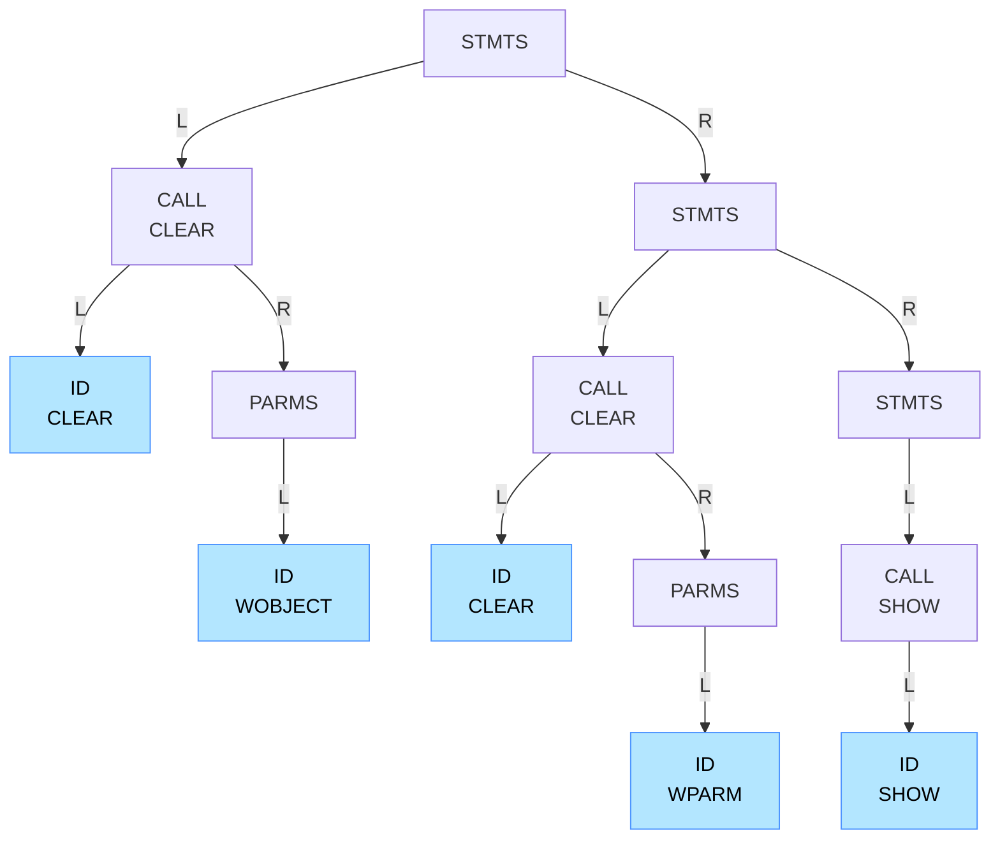

# Abstract Syntax Tree: astt_rules

## Tree Structure



## Source Code

```cpp
ASTT_STMTS
```

## Metadata

- **Generated**: 2025-04-08 20:29:00
- **Node Count**: 13
- **Max Depth**: 4
- **AST Type**: STMTS
